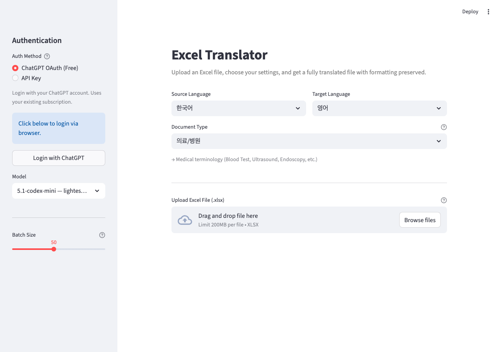

# LLM Excel Translator

Translate Excel (.xlsx) files between languages while preserving all formatting — merged cells, fonts, colors, borders, column widths, and more.

Built for domain-specific documents (medical, legal, technical) with smart cell filtering and translation caching to minimize API calls.

<p align="center">
  
</p>

## Features

- **Format preservation** — Merged cells, fonts, colors, borders, column widths, row heights all kept intact
- **Domain-specific translation** — Medical/hospital, legal, technical, business terminology support
- **ChatGPT OAuth** — Login with your ChatGPT account (free for Plus subscribers, no API costs)
- **API Key mode** — Standard OpenAI API key as fallback
- **Smart cell filtering** — Skips numbers, symbols, and cells without source language characters
- **Translation cache** — Identical cell content translated once and reused (96% cache hit rate on real-world files)
- **Unique-first pipeline** — Extracts unique texts → batch translates → applies cache to all cells
- **Multi-line cell handling** — Flattens newlines before sending to LLM, restores after translation
- **Auto-retry** — Missed translations are automatically retried with smaller batches
- **Rate limit handling** — Exponential backoff on 429 errors (up to 5 retries)
- **10 languages** — Korean, English, Japanese, Chinese (Simplified/Traditional), Spanish, French, German, Vietnamese, Thai

## Quick Start

### Docker (recommended)

```bash
docker build -t excel-translator .
docker run -d --name excel-translator -p 8501:8501 -p 1455:1455 excel-translator
```

Open `http://localhost:8501` in your browser.

### Local

```bash
pip install -r requirements.txt
streamlit run app.py
```

## Usage

1. **Authenticate** — Click "Login with ChatGPT" in the sidebar (or enter an API key)
2. **Select languages** — Source and target language
3. **Select domain** — Medical, legal, technical, business, or general
4. **Upload** — Drag and drop your `.xlsx` file
5. **Review stats** — See total cells, unique texts, estimated API calls, and cache hit rate
6. **Translate** — Click the translate button and watch the progress bar
7. **Download** — Get your translated file with all formatting preserved

## Architecture

```
app.py              Streamlit web UI
translator.py       Translation engine (batch, cache, flatten/unflatten, retry)
excel_handler.py    Excel read/write with style preservation and cell filtering
oauth_openai.py     OAuth PKCE authentication flow
codex_client.py     Codex API client with SSE parsing and rate limit retry
```

### Translation Pipeline

```
Upload .xlsx
    → Extract all translatable cells (filter out numbers/symbols)
    → Deduplicate to unique texts (e.g., 30,032 cells → 1,179 unique)
    → Flatten multi-line content (newlines → ∥ delimiter)
    → Batch translate unique texts via LLM
    → Auto-retry any missed translations
    → Unflatten (∥ → newlines)
    → Apply cached translations to all cells
    → Save .xlsx with original formatting
```

## Configuration

| Setting | Options | Default |
|---------|---------|---------|
| Auth | ChatGPT OAuth / API Key | OAuth |
| OAuth Models | gpt-5.1-codex-mini, gpt-5.1-codex, gpt-5.2-codex | gpt-5.1-codex-mini |
| API Key Models | gpt-4o-mini, gpt-4o | gpt-4o-mini |
| Batch Size | 10–100 | 50 |
| Domain | Medical, Legal, Technical, Business, General | Medical |

## Requirements

- Python 3.12+
- Docker (optional, recommended)
- ChatGPT Plus subscription (for OAuth mode) or OpenAI API key

---

## 한국어 설명

### 개요

엑셀(.xlsx) 파일을 통째로 번역하는 웹 앱입니다. 병합 셀, 글꼴, 색상, 테두리, 열 너비 등 모든 서식을 그대로 유지하면서 번역합니다.

병원/의료 문서처럼 전문 용어가 많은 문서에 특화되어 있으며, ChatGPT Plus 구독자라면 추가 비용 없이 OAuth 로그인만으로 사용할 수 있습니다.

### 주요 기능

- **서식 완전 보존** — 병합 셀, 폰트, 배경색, 테두리, 열/행 크기 전부 유지
- **도메인별 번역** — 의료/병원, 법률, 기술/IT, 비즈니스 전문 용어 지원
- **ChatGPT OAuth 인증** — ChatGPT 계정으로 로그인 (Plus 구독자 무료, API 비용 없음)
- **API Key 지원** — OpenAI API 키로도 사용 가능
- **스마트 필터링** — 숫자, 기호, 번역 불필요한 셀은 자동으로 건너뜀
- **번역 캐시** — 동일한 내용의 셀은 한 번만 번역하고 재사용 (실제 파일에서 96% 캐시 적중률)
- **자동 재시도** — 누락된 번역은 자동으로 소규모 배치로 재시도
- **10개 언어 지원** — 한국어, 영어, 일본어, 중국어(간체/번체), 스페인어, 프랑스어, 독일어, 베트남어, 태국어

### 사용 방법

```bash
# Docker로 실행
docker build -t excel-translator .
docker run -d --name excel-translator -p 8501:8501 -p 1455:1455 excel-translator
```

브라우저에서 `http://localhost:8501` 접속 후:

1. 사이드바에서 **ChatGPT OAuth 로그인** (또는 API Key 입력)
2. **원본 언어 / 대상 언어** 선택
3. **문서 유형** 선택 (의료/병원, 법률, 기술, 비즈니스, 일반)
4. **.xlsx 파일 업로드** — 드래그 앤 드롭
5. 파일 통계 확인 — 전체 셀 수, 유니크 텍스트 수, 예상 API 호출 수, 캐시 적중률
6. **번역 버튼** 클릭 — 진행률 실시간 표시
7. **번역 완료된 파일 다운로드** — 원본 서식 그대로 유지

### 번역 파이프라인

```
엑셀 업로드
    → 번역 대상 셀 추출 (숫자/기호 제외)
    → 유니크 텍스트 추출 (예: 30,032셀 → 1,179개 유니크)
    → 멀티라인 셀 정규화 (줄바꿈 → ∥ 구분자)
    → 유니크 텍스트만 LLM 배치 번역
    → 누락 번역 자동 재시도
    → 구분자 복원 (∥ → 줄바꿈)
    → 캐시된 번역을 전체 셀에 적용
    → 원본 서식 유지하여 .xlsx 저장
```

### 요구 사항

- Python 3.12+
- Docker (선택, 권장)
- ChatGPT Plus 구독 (OAuth 모드) 또는 OpenAI API 키
